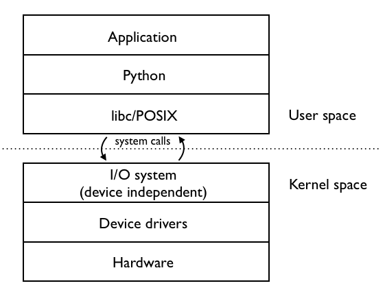
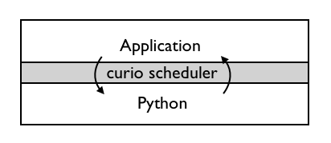

Developing with Curio
=====================

(This is a work in progress)

So, you want to write a larger application or library that depends on
Curio? This document describes the overall philosophy behind Curio,
how it works under the covers, and how you might approach software
development using it.

Please, Don't Use Curio!
------------------------

Let's be frank for a moment--you really don't want to use Curio.  All
things equal, you should probably be programming with threads.  Yes,
threads. THOSE threads. Seriously. I'm not kidding.

"But what about the GIL?" you ask.  Yes, yes, that can sometimes be an
issue.

"Or what about the fact that no one is smart enough to program with
threads?"  Okay, yes, a lot of computer science students have exploded
their head trying to solve something like the "Sleeping Barber"
problem on their Operating Systems final exam.  Yes, it can get tricky 
sometimes.

"And what about making everything web-scale?"  Yes, threads might
not let you run the next Facebook on a single server instance.  Point taken.

All of these are perfectly valid concerns.  However, the truth of the
matter is that threads still actually work pretty well for a lot of
problems--most problems really.  For one, it is extremely unlikely
that you're building the next Facebook. If all you need to do is serve
a few hundred clients at once, threads will work fine for that.
Second, there are well-known ways to make thread programming sane.
For example, using functions, avoiding shared state and side effects,
and coordinating threads with queues.  As for the dreaded GIL, that is
mainly a concern for CPU-intensive processing.  Although it's an
annoyance, there are known ways to work around it using process pools,
distributed computation, or C extensions.  Finally, threads have the
benefit of working with almost any existing Python code. All of the
popular packages (e.g., requests, SQLAlchemy, Django, Flask, etc.)
work fine with threads.  I use threads in production.  There, I've
said it.

Now, suppose that you've ignored this advice or that you really do
need to write an application that can handle 10000 concurrent client
connections.  In that case, a coroutine-based library like Curio might
be able to help you.  Before beginning though, be aware that
coroutines are part of a strange new world.  They execute differently
than normal Python code and don't play well with existing libraries.
Nor do they solve the problem of the GIL or give you increased
parallelism.  In addition to seeing new kinds of bugs, coroutines
will likely make you swat your arms in the air as you fight swarms of stinging bats
and swooping manta rays.  Your coworkers will keep their distance more
than usual.  Coroutines are weird, finicky, fun, and amazing
(sometimes all at once).  Only you can decide if this is what you
really want.

Curio makes it all just a bit more interesting by killing off every
beloved character of asynchronous programming in the
first act.  The event loop? Dead. Futures? Dead. Protocols?
Dead. Transports?  You guessed it, dead. And the scrappy hero, Callback
"Buck" Function? Yep, dead. Big time dead--as in not just "pining for
the fjords" dead.  Tried to apply a monkeypatch. It failed.  Now, when
Curio goes to the playlot and asks "who wants to interoperate?", the
other kids are quickly shuttled away by their fretful parents.

And a hollow voice says "plugh."

Say, have you considered using threads?  Or almost anything else?

Coroutines
----------

First things, first.  Curio is solely focused on solving one specific
problem--and that's the scheduling of coroutines.   This section covers
some basics.

Defining a Coroutine
^^^^^^^^^^^^^^^^^^^^

A coroutine is a function defined using ``async def`` such as this::

    >>> async def greeting(name):
    ...     return 'Hello ' + name

Unlike a normal function, a coroutine never executes independently.
It has to be driven by some other code.  It's low-level, but you can
drive a coroutine manually if you want::

    >>> g = greeting('Dave')
    >>> g
    <coroutine object greeting at ...>
    >>> g.send(None)
    Traceback (most recent call last):
      File "<stdin>", line 1, in <module>
    StopIteration: Hello Dave
    >>> 

Normally, you wouldn't do this though. Curio provides a high-level
function that runs a coroutine and returns its final result::

    >>> from curio import run
    >>> run(greeting('Dave'))
    'Hello Dave'
    >>>

By the way, ``run()`` is basically the only function Curio provides to
the outside world of non-coroutines. Remember that. It's "run". Three letters.

Coroutines Calling Coroutines
^^^^^^^^^^^^^^^^^^^^^^^^^^^^^

Coroutines can call other coroutines as long as you preface the call
with the ``await`` keyword.  For example::

    >>> async def main():
    ...      names = ['Dave', 'Paula', 'Thomas', 'Lewis']
    ...      for name in names:
    ...          print(await greeting(name))
    >>> from curio import run
    >>> run(main())
    Hello Dave
    Hello Paula
    Hello Thomas
    Hello Lewis

For the most part, you can write async functions, methods, and do everything that you
would do with normal Python functions.  The use of the ``await`` in calls is important
though--if you don't do that, the called coroutine won't run and you'll be fighting
the aforementioned swarm of stinging bats trying to figure out what's wrong.

Blocking Calls (i.e., "System Calls")
^^^^^^^^^^^^^^^^^^^^^^^^^^^^^^^^^^^^^

When a program runs, it executes statements one after the other until
the services of the operating system are needed (e.g., sleeping, reading a file, 
receiving a network packet, etc.).  For example::

     import time
     time.sleep(10)

Under the covers, this operation ultimately involves making a "system call."
System calls are different than normal functions in that they involve
making a request to the operating system kernel by executing a "trap."
A trap is like a software-generated interrupt.  When it occurs, the
running process is suspended and the operating system takes over to
handle the request. Control doesn't return until the operating system
completes the request and reschedules the process.

Now, what does all of this have to do with coroutines?  Let's define
a very special kind of coroutine::

   >>> from types import coroutine
   >>> @coroutine
   ... def sleep(seconds):
   ...     yield ('sleep', seconds)

This coroutine is different than the rest--it doesn't use the
``async`` syntax and it makes direct use of the ``yield`` statement
(which is not normally allowed in ``async`` functions).  The ``@coroutine``
decorator is there so that it can be called with ``await``.
Now, let's write a coroutine that uses this::

   >>> async def main():
   ...     print('Yawn. Getting sleepy.')
   ...     await sleep(10)
   ...     print('Awake at last!')

Let's manually drive it using the same technique as before::
 
    >>> c = main()
    >>> request = c.send(None)
    Yawn. Getting sleepy.
    >>> request
    ('sleep', 10)

The output from the first ``print()`` function appears, but the
coroutine is now suspended. The return value of the
``send()`` call is the tuple produced by the ``yield`` statement in
the ``sleep()`` coroutine.  This is exactly the same concept as a
trap.  The coroutine has suspended itself and made a request (in this
case, a request to sleep for 10 seconds).  It is now up to the driver
of the code to satisfy that request.  As far as the coroutine is
concerned, the details of how this is done don't matter.  It's just
assumed that the coroutine will be resumed after 10 seconds have
elapsed.  To do that, you call ``send()`` again on the coroutine (with a
return result if any).   For example::

    >>> c.send(None)
    Awake at last!
    Traceback (most recent call last):
      File "<stdin>", line 1, in <module>
    StopIteration

All of this might seem very low-level, but this is precisely what
Curio is doing. Coroutines execute statements under the
supervision of a small kernel.  When a coroutine executes a system
call (e.g., a special coroutine that makes use of ``yield``), 
the kernel receives that request and acts upon it.  The coroutine
resumes once the request has completed.

Keep in mind that all of this machinery is hidden from view.  Your
application doesn't actually see the Curio kernel or use code that
directly involves the ``yield`` statement. Those are low-level
implementation details--like machine code.  Your code will simply make
a high-level call such as ``await sleep(10)`` and it will just work.

Coroutines and Multitasking
^^^^^^^^^^^^^^^^^^^^^^^^^^^

As noted, system calls almost always involve waiting or blocking.  For
example, waiting for time to elapse, waiting to receive a network
packet, etc.  While waiting, it might be possible to switch to another
coroutine that's able to run--this is multitasking.  If there are
multiple coroutines, the kernel can cycle between them by running each
one until it executes a system call, then switching to the next ready
coroutine at that point.  Your operating system does exactly the same
thing when processes execute actual system calls.  The ability to 
switch between coroutines is why they are useful for concurrent
programming.

Coroutines versus Threads
^^^^^^^^^^^^^^^^^^^^^^^^^

Code written using coroutines looks very similar to code written using
threads.  To see this, here is a simple echo server that handles
concurrent clients using Python's ``threading`` module::

    # echoserv.py
    
    from socket import *
    from threading import Thread
    
    def echo_server(address):
        sock = socket(AF_INET, SOCK_STREAM)
        sock.setsockopt(SOL_SOCKET, SO_REUSEADDR, 1)
        sock.bind(address)
        sock.listen(5)
        print('Server listening at', address)
        with sock:
            while True:
                client, addr = sock.accept()
                Thread(target=echo_client, args=(client, addr), daemon=True).start()
    
    def echo_client(client, addr):
        print('Connection from', addr)
        with client:
             while True:
                 data = client.recv(100000)
                 if not data:
                     break
                 client.sendall(data)
        print('Connection closed')

    if __name__ == '__main__':
        echo_server(('',25000))

Now, here is the same code written using coroutines and Curio::

    # echoserv.py
    
    from curio import run, spawn
    from curio.socket import *
    
    async def echo_server(address):
        sock = socket(AF_INET, SOCK_STREAM)
        sock.setsockopt(SOL_SOCKET, SO_REUSEADDR, 1)
        sock.bind(address)
        sock.listen(5)
        print('Server listening at', address)
        async with sock:
            while True:
                client, addr = await sock.accept()
                await spawn(echo_client(client, addr))
    
    async def echo_client(client, addr):
        print('Connection from', addr)
        async with client:
             while True:
                 data = await client.recv(100000)
                 if not data:
                     break
                 await client.sendall(data)
        print('Connection closed')

    if __name__ == '__main__':
        run(echo_server(('',25000)))

Both versions of code involve the same statements and have the same overall
control flow.  The key difference is that threads support
preemption whereas coroutines do not. This means that in the threaded
code, the operating system can switch threads on any statement. With
coroutines, task switching can only occur on statements that involve
``await``.

Both approaches have advantages and disadvantages.  One potential
advantage of the coroutine approach is that you explicitly know where
task switching might occur. Thus, if you're writing code that involves
tricky task synchronization or coordination, it might be easier to
reason about about its behavior.  One disadvantage of coroutines is
that any kind of long-running calculation or blocking operation can't
be preempted.  So, a coroutine might hog the CPU for an extended
period and force other coroutines to wait.  Another downside is that
code must be written to explicitly take advantage of coroutines (e.g.,
explicit use of ``async`` and ``await``).  Threads, on the other hand,
can work with any existing Python code.

Coroutines versus Callbacks
^^^^^^^^^^^^^^^^^^^^^^^^^^^

For I/O handling, libraries and frameworks will sometimes make use of
callback functions.  For example, here is an echo server written in
the callback style using Python's ``asyncio`` module::

    import asyncio

    class EchoProtocol(asyncio.Protocol):
        def connection_made(self, transport):
            print('Got connection')
            self.transport = transport

        def connection_lost(self, exc):
            print('Connection closed')
            self.transport = None

        def data_received(self, data):
            self.transport.write(data)

    if __name__ == '__main__':
        loop = asyncio.get_event_loop()
        coro = loop.create_server(EchoProtocol, '', 25000)
        srv = loop.run_until_complete(coro)
        loop.run_forever()

In this code, different methods of the ``EchoProtocol`` class are
triggered in response to I/O events. 

Programming with callbacks is a well-known technique for asynchronous
I/O handling that is used in programming languages without proper
support for coroutines.  It can be efficient, but it also tends to
result in code that's described as a kind of "callback hell"--a large
number of tiny functions with no easily discerned strand of control
flow tying them together.

Coroutines restore a lot of sanity to the overall programming model.
The control-flow is much easier to follow and the number of
required functions tends to be significantly less.  In fact, the main
motivation for adding ``async`` and ``await`` to Python and other languages is
to simplify asynchronous I/O by avoiding callback hell.

Historical Perspective
^^^^^^^^^^^^^^^^^^^^^^

Coroutines were first invented in the earliest days of computing to
solve problems related to multitasking and concurrency.  Given the
simplicity and benefits of the programming model, one might wonder why
they haven't been used more often.

A big part of this is really due to the lack of proper support in
mainstream programming languages used to write systems software.
For example, languages such as Pascal, C/C++, and Java don't support
coroutines. Thus, it's not a technique that most programmers would even think to 
consider.  Even in Python, proper support for coroutines has taken a
long time to emerge.  Over the years, various projects have explored
coroutines in various forms, usually involving sneaky hacks surrounding
generator functions and C extensions.  The addition of the ``yield from``
construct in Python 3.3 greatly simplified the problem of writing
coroutine libraries.  The emergence of ``async/await`` in Python 3.5
takes a huge stride in making coroutines more of a first-class object
in the Python world.   This is really the starting point for Curio.

Layered Architecture
--------------------

One of the most important design principles of systems programming is
layering. Layering is an essential part of understanding how Curio works
so let's briefly discuss this idea.

Operating System Design and Programming Libraries
^^^^^^^^^^^^^^^^^^^^^^^^^^^^^^^^^^^^^^^^^^^^^^^^^

Think about how I/O works in the operating system for a moment. At the
lowest level, you'll find device drivers and
other hardware-specific code.  However, the bulk of the operating
system is not written to operate at this low-level. Instead, those
details are hidden behind a device-independent abstraction layer that
manages file descriptors, I/O buffering, flow control, and other
details. 

The same layering principal applies to user applications.  The operating
system provides a set of low-level system calls (traps).  These calls
vary between operating systems, but you don't really care as a
programmer.  That's because the implementation details are hidden
behind a layer of standardized programming libraries such as the C
standard library, various POSIX standards, Microsoft Windows APIs,
etc.  Working in Python removes you even further from
platform-specific library details. For example, a network program
written using Python's ``socket`` module will work virtually
everywhere.  This is layering and abstraction in action.

The Curio Scheduler
^^^^^^^^^^^^^^^^^^^

Curio primarily operates as a coroutine scheduling layer that sits
between an application and the Python standard library.  This layer
doesn't actually carry out any useful functionality---it is only
concerned with task scheduling.  Just to emphasize, the scheduler
doesn't perform any kind of I/O.  There are no internal protocols,
streams, buffering, or anything you'd commonly associate with the
implementation of an I/O library.

To make the scheduling process work, Curio relies on non-blocking I/O.
With non-blocking I/O, any system call that would ordinarily cause the
calling process to block fails with an exception.   You can try it
out manually::

    >>> from socket import *
    >>> s = socket(AF_INET, SOCK_STREAM)
    >>> s.bind(('',25000))
    >>> s.listen(1)
    >>> s.setblocking(False)
    >>> c, a = s.accept()
    Traceback (most recent call last):
      File "<stdin>", line 1, in <module>
      File "/usr/local/lib/python3.5/socket.py", line 195, in accept
        fd, addr = self._accept()
    BlockingIOError: [Errno 35] Resource temporarily unavailable
    >>> 

To handle the exception, the calling process has to wait for an incoming connection.
Curio provides a special system call for this called ``_read_wait()``.   Here's a
coroutine that uses it::

    >>> from curio import run
    >>> from curio.traps import _read_wait
    >>> async def accept_connection(s):
    ...      while True:
    ...          try:
    ...              return s.accept()
    ...          except BlockingIOError:
    ...              await _read_wait(s)
    ...
    >>> c, a = run(accept_connection(s))

With that code running, try making a connection using ``telnet``, ``nc`` or similar command.
You should see the ``run()`` function return the result after the connection is made.

Now, a couple of important details about what's happening:

* The actual I/O operation is performed using the normal ``accept()`` method of
  a socket.  It is the same method that's used in synchronous code not involving coroutines.

* Curio only enters the picture if the attempted I/O operation raises a
  ``BlockingIOError`` exception.  In that case, the coroutine must wait for I/O
  and retry the I/O operation later (the retry is why it's enclosed in a ``while`` loop).

* Curio does not actually perform any I/O. It is only responsible for waiting.
  The ``_read_wait()`` call sleeps until the associated socket can be read.

* Incoming I/O is not handled as an "event" nor are there any
  associated callback functions.  If an incoming connection is received, the coroutine
  wakes up.  That's it.  There is no "event loop."

With the newly established connection, write a coroutine that receives some data::

    >>> async def read_data(s, maxsize):
    ...     while True:
    ...         try:
    ...              return s.recv(maxsize)
    ...         except BlockingIOError:
    ...              await _read_wait(s)
    ... 
    >>> data = run(read_data(c, 1024))

Try typing some input into your connection.  You should see that data
returned.  Notice that the code is basically the same as before.  An
I/O operation is attempted using the normal socket ``recv()``
method. If it fails, then the coroutine waits using the
``_read_wait()`` call.  Just to be clear.  There is no event loop and
Curio is not performing any I/O. Curio is only responsible for
waiting--that is basically the core of it.

On the subject of waiting, here is a list of the things that
Curio knows how to wait for:

* Expiration of a timer (e.g., sleeping).
* I/O operations (read, write).
* Completion of a ``Future`` from the ``concurrent.futures`` standard library.
* Arrival of a Unix signal.
* Removal of a coroutine from a wait queue.
* Termination of a coroutine.

Everything else is built up from those low-level primitives.

The Proxy Layer
^^^^^^^^^^^^^^^

If you wanted to, you could program directly with low-level calls like
``_read_wait()`` as shown in the previous part.  However, no one
really wants to do that.  Instead, it's easier to create a collection
of proxy objects that hide the details.  For example, you could make a
coroutine-based socket proxy class like this::

    from curio.traps import _read_wait

    class Socket(object):
        def __init__(self, sock):
            self._sock = sock
            self._sock.setblocking(False)

        async def accept(self):
            while True:
                try:
                    client, addr = self._sock.accept()
                    return Socket(client), addr
                except BlockingIOError:
                    await _read_wait(self._sock)

        async def recv(self, maxsize):
            while True:
                try:
                    return self._sock.recv(maxsize)
                except BlockingIOError:
                    await _read_wait(self._sock)

        # Other socket methods follow
        ...

        # Delegate other socket methods
        def __getattr__(self, name):
            return getattr(self._sock, name)

This class invokes the standard socket methods, but has a small amount
of extra code to deal with coroutine scheduling.  Using this, your
code starts to look much more normal. For example::

     async def echo_server(address):
          sock = Socket(socket(AF_INET, SOCK_STREAM))
          sock.bind(address)
          sock.listen(1)
          while True:
               client, addr = await sock.accept()
               print('Connection from', addr)
               await spawn(echo_client(client))
 
     async def echo_client(sock):
          while True:
               data = await sock.recv(100000)
               if not data:
                   break
               await sock.sendall(data)

This is exactly what's happening in the
``curio.socket`` module.  It provides a coroutine wrapper around a
normal socket and let's you write normal-looking socket code.

It's important to emphasize that a proxy doesn't change how you
interact with an object.  You use the same method names as you did
before coroutines and you should assume that they have the same
underlying behavior. Curio is really only concerned with the
scheduling problem--not I/O.

The Curio Task Model
--------------------

When a coroutine runs inside Curio, it becomes a "Task."  This 
section describes the overall task model and operations on tasks.

Creating Tasks
^^^^^^^^^^^^^^

An application that uses Curio is always launched by providing an initial
coroutine to the ``run()`` function.  For example::

    import curio

    async def main():
        print('Starting')
        ...

    curio.run(main())

That first coroutine becomes the initial task.  If you want to create
more tasks that execute concurrently, use the ``spawn()`` coroutine. 
``spawn()`` is only valid inside other coroutines so you might use it to
launch more tasks inside ``main()`` like this::

    import curio
    
    async def child(n):
        print('Sleeping')
        await curio.sleep(n)
        print('Awake again!')

    async def main():
        print('Starting')
        await curio.spawn(child(5))

    curio.run(main())

If you want to wait for a task to finish, save the result of ``spawn()`` and use its
``join()`` method.  For example::

    async def main():
        print('Starting')
        task = await curio.spawn(child(5))
        await task.join()
        print('Quitting')

If you've programmed with threads, the programming model is similar.  One important
point though---you only use ``spawn()`` if you want concurrent task execution.
If a coroutine merely wants to call another coroutine in a synchronous manner like a
library function, you just use ``await``.  For example::

    async def main():
        print('Starting')
        await child(5)      
        print('Quitting')

Returning Results
^^^^^^^^^^^^^^^^^

The ``task.join()`` method returns the final result of a coroutine.  For example::

    async def add(x, y):
        return x + y

    async def main():
        task = await curio.spawn(add(2,3))
        result = await task.join()
        print('Result ->', result)    # Prints 5

If an exception occurs in the task, it is wrapped in a ``TaskError``
exception.  This is a chained exception where the ``__cause__``
attribute contains the actual exception that occurred.  For example::

    async def main():
        task = await curio.spawn(add(2, 'Hello'))   # Fails due to TypeError
        try:
            result = await task.join()
        except curio.TaskError as err:
            # Reports the resulting TypeError
            print('It failed. Cause:', repr(err.__cause__))

The use of ``TaskError`` serves an important, but subtle, purpose
here.  Due to cancellation and timeouts, the ``task.join()`` operation
might raise an exception that's unrelated to the underlying task
itself.  This means that you need to have some way to separate
exceptions related to the ``join()`` operation versus an
exception that was raised inside the task.  The ``TaskError`` solves
this issue--if you get that exception, it means that the task being joined exited 
with an exception.  If you get other exceptions, they
are related to some aspect of the ``join()`` operation itself (i.e.,
cancellation), not the underlying task.

Task Cancellation
^^^^^^^^^^^^^^^^^

Curio allows any task to be cancelled.  Here's an example::

    import curio
    
    async def child(n):
        print('Sleeping')
        await curio.sleep(n)
        print('Awake again!')

    async def main():
        print('Starting')
        task = await curio.spawn(child(5))
        await time.sleep(1)
        await task.cancel()     # Cancel the child

    curio.run(main())

Cancellation only occurs on blocking operations (e.g., the ``curio.sleep()`` call in the child).
When a task is cancelled, the current operation fails with a ``CancelledError`` exception. This
exception can be caught::

    async def child(n):
        print('Sleeping')
        try:
            await curio.sleep(n)
            print('Awake again!')
        except curio.CancelledError:
            print('Rudely cancelled')

A cancellation should not be ignored.  In fact, the ``task.cancel()``
method blocks until the task actually terminates.  If ignored, the
cancelling task would simply hang forever waiting.  That's probably
not what you want.

Cancellation does not propagate to child tasks that a coroutine might
have been spawned.  For example, consider this code::

    from curio import sleep, spawn, run

    async def sleeper(n):
        print('Sleeping for', n)
        await sleep(n)
        print('Awake again')

    async def coro():
        task = await spawn(sleeper(10))
        try:
            await task.join()
        except CancelledError:
            print('Cancelled')

    async def main():
        task = await spawn(coro())
        await sleep(1)
        await task.cancel()

    run(main())

If you run this code, the ``coro()`` coroutine is cancelled, but its child task continues to run afterwards.
The output looks like this::

    Sleeping for 10
    Cancelled
    Awake again

To cancel children, they must be explicitly cancelled.  Rewrite ``coro()`` like this::

    async def coro():
        task = await spawn(sleeper(10))
        try:
            await task.join()
        except CancelledError:
            print('Cancelled')
            await task.cancel()        # Cancel child task

Since cancellation doesn't propagate except explicitly as shown, one
way to shield a coroutine from cancellation is to launch it as a
separate task using ``spawn()``. Unless it's directly cancelled, a
task always runs to completion.

Timeouts
^^^^^^^^

Curio allows every blocking operation to be aborted with a timeout.  However, 
instead of instrumenting every possible API call with a ``timeout`` argument,
it is applied through ``timeout_after(seconds [, coro])``.  For example::

    from curio import *

    async def child():
        print('Yawn. Getting sleeping')
        await sleep(10)
        print('Back awake')

    async def main():
        try:
            await timeout_after(1, child())
        except TaskTimeout:
            print('Timeout')

    run(main())

After the specified timeout period expires, a ``TaskTimeout``
exception is raised by whatever blocking operation happens to be in
progress.  It is critical to emphasize that timeouts can only
occur on operations that block in Curio.  If the code runs
away to go compute gigantic fibonacci numbers for the next ten minutes,
a timeout won't be raised--remember that coroutines can't be preempted
except on blocking operations.

The ``timeout_after()`` function can also be used as a context manager.
This allows it to be applied to an entire block of statements. For
example::

    try:
        async with timeout_after(5):
             await coro1()
             await coro2()
             ...
    except TaskTimeout:
        print('Timeout')

Sometimes you might just want to stop an operation and silently move
on. For that, you can use the ``ignore_after()`` function.  It works
like ``timeout_after()`` except that it doesn't raise an exception.
For example::

    result = ignore_after(seconds, coro())
    
In the event of a timeout, the return result is ``None``. So, instead
of using ``try-except``, you could do this::

    if ignore_after(seconds, coro()) == None:
        print('Timeout')

The ``ignore_after()`` function also works as a context-manager. When
used in this way, a ``result`` attribute is set to ``None`` when a 
timeout occurs. For example::

    async with ignore_after(seconds) as t:
        await coro1()
        await coro2()
        ...
        t.result = value     # Set a result (optional)

    if t.result == None:
        print('Timeout')

Timeouts can be nested, but the semantics are a bit hair-raising.  To
illustrate, consider this bit of code::

    async def coro1():
        print('Coro1 Start')
        await sleep(10)
        print('Coro1 Success')

    async def coro2():
        print('Coro2 Start')
        await sleep(1)
        print('Coro2 Success')

    async def child():
        try:
            await timeout_after(50, coro1())
        except TaskTimeout:
            print('Coro1 Timeout')

        await coro2()

    async def main():
        try:
            await timeout_after(5, child())
        except TaskTimeout:
            print('Parent Timeout')

If you run this program, you will get the following output::

    Coro1 Start
    Coro1 Timeout         (appears after 5 seconds)
    Coro2 Start
    Parent Timeout        (appears immediately)

To understand this output, there are two important rules in play.
First, the actual timeout period in effect is always the smallest of
all of the applied timeout values. In this code, the outer ``main()``
coroutine applies a 5 second timeout to the ``child()`` coroutine.
Even though the ``child()`` coroutine attempts to apply a 50 second
timeout to ``coro1()``, the 5 second expiration already applied is
kept in force.  This is why ``coro1()`` receives a timeout when it sleeps
for 10 seconds.

The second rule of timeouts is that the ``timeout_after()`` function
always restores any previous timeout setting when it completes.  In
the above code, the ``coro1()`` coroutine receives a timeout, which is
appropriately handled. However, the ``child()`` coroutine continues to
run afterwards--moving on to call the ``coro2()`` coroutine.  When
``coro2()`` calls ``await sleep(1)``, it immediately fails with
``TaskTimeout`` exception. This happens because of the restoration of
the prior timeout--essentially Curio sees that the 5 second time period has
already expired and raises ``TaskTimeout``.

Admittedly, all of this is a bit subtle, but the key idea is that each
``timeout_after()`` function is guaranteed to either run the given
coroutine to completion or to generate at least one ``TaskTimeout``
exception.  Since the above code uses ``timeout_after()`` twice, there
are two separate ``TaskTimeout`` exceptions that might get raised.

There are are still some ways that timeouts can go wrong and you'll
find yourself battling a sky full of swooping manta rays.  The best
way to make your head explode is to catch ``TaskTimeout`` exceptions
in code that doesn't use ``timeout_after()``.  For example::

    async def child():
         while True:
              try:
                   print('Sleeping')
                   await sleep(10)
              except TaskTimeout:
                   print('Ha! Nope.')

    async def parent():
         try:
             await timeout_after(5, child())
         except TaskTimeout:
             print('Timeout')

In this code, the ``child()`` catches ``TaskTimeout``, but basically
ignores it--running forever.  The ``parent()`` coroutine will hang
forever waiting for the ``child()`` to exit.  The output of the
program will look like this::

    Sleeping
    Ha! Nope.       (after 5 seconds)
    Sleeping
    Sleeping
    ... forever...

Bottom line:  Don't catch ``TaskTimeout`` exceptions unless you're also
using ``timeout_after()``.  Another possible way to shoot yourself in the
foot is to structure nested timeouts in a way that exceptions don't
propagate properly.  For example, consider this::

    async def child():
         while True:
              try:
                   result = await timeout_after(1, coro())
                   ...
              except TaskTimeout:
                   pass

    async def parent():
         try:
             await timeout_after(5, child())
         except TaskTimeout:
             print('Timeout')

In this code, timeouts are always associated with the inner
``timeout_after()`` call in ``child()``.  The resulting exceptions get
handled, but they're never allowed to propagate back out to the
``parent()`` coroutine.  Ultimately, the code will get caught in some
kind of strange infinite timeout loop as it repeatedly tries to abort back out to
the parent, but never does so.  You need to make sure that there is a
way for a ``TaskTimeout`` exception to be raised and provide a route
for it to propagate back to the associated ``timeout_after()`` call. For
example, re-raising the exception::

    async def child():
         while True:
              try:
                   result = await timeout_after(1, coro())
                   ...
              except TaskTimeout:
                   # Handle the timeout in some way 
                   ...
                   raise

It should be noted that timeouts can be temporarily suspended if you use
``None`` as a timeout.  For example::

    await timeout_after(None, coro())

In this case, ``coro()`` is guaranteed to run fully to completion
without a timeout.  This is true even if another timeout was already
in effect.  In some sense, this shields ``coro()`` from a timeout.
As a general rule, you probably want to avoid doing this except for
extremely critical operations that have to complete no matter what.
If a timeout has been applied, it was probably applied for a good reason.
Your code should try to honor that.

Waiting for Multiple Tasks and Concurrency
^^^^^^^^^^^^^^^^^^^^^^^^^^^^^^^^^^^^^^^^^^

When a task is launched using ``spawn()``, it executes concurrently with the
creating coroutine.  If you need to wait for the task to finish, you normally
use ``join()`` as described in the previous section.

If you create multiple tasks, you might want to wait for them to complete in 
more advanced ways.  For example, obtaining results one at a time in the order
that tasks finish.  Or waiting for the first result to come back and cancelling
the remaining tasks afterwards. 

For these kinds of problems, you can use the ``wait()`` coroutine.
Here is an example that uses ``wait()`` to obtain results in the order that
they're completed::

    async def main():
        # Create some tasks
        task1 = await spawn(coro())
        task2 = await spawn(coro())
        task3 = await spawn(coro())

        # Wait for the tasks in completion order
        async for task in wait([task1, task2, task3]):
             try:
                 result = await task.join()
                 print('Success:', result)
             except TaskError as e:
                 print('Failed:', e)

To have remaining tasks cancelled, use ``wait()`` as a context
manager.  For example, this code obtains the first result completed
and then cancels all of the remaining tasks::

    async def main():
        # Create some tasks
        task1 = await spawn(coro())
        task2 = await spawn(coro())
        task3 = await spawn(coro())

        # Wait for the first task to complete. Cancel all of the remaining tasks
        async with wait([task1, task2, task3]) as w:
             task = await w.next_done()
             try:
                 result = await task.join()
                 print('Success:', result)
             except TaskError as e:
                 print('Failed - Reason:', e.__cause__)

One feature of ``wait()`` is that it does not actually return the results of
completed tasks. Instead, it always produces the associated ``Task`` instance.
Partly, this is so you can figure which of the tasks actually completed.  To
get the result, you call ``task.join()`` and handle it in the usual way.  Just as
a reminder, exceptions produce a ``TaskeError`` exception that wraps around the
actual exception.

Getting a Task Self-Reference
^^^^^^^^^^^^^^^^^^^^^^^^^^^^^

When a coroutine is running in Curio, there is always an associated ``Task`` instance.
It is returned by the ``spawn()`` function. For example::

    task = await spawn(coro())

The ``Task`` instance is normally only needed for operations
involving joining or cancellation and typically those steps are performed
in the same code that called ``spawn()``.   If for some reason, you need
the ``Task`` instance and don't have a reference to it available, you can
use ``current_task()`` like this::

    from curio import current_task

    async def coro():
        #  Get the Task that's running me
        task = await current_task()      # Get Task instance
        ...

Here's a more interesting example of a function that applies a watchdog
to the current task, cancelling it if nothing happens within a certain
time period::

    from curio import *

    async def watchdog(interval):
        task = await current_task()
        async def watcher():
            while not task.terminated:
                cycles = task.cycles
                await sleep(interval)
                if cycles == task.cycles:
                    print('Cancelling', task)
                    await task.cancel()
        await spawn(watcher())

   async def coro():
       await watchdog(30)     # Enable a watchdog timer
       await sleep(10000)

   run(coro())

In this code, you can see how ``current_task()`` is used to get a Task
self-reference in the ``watchdog()`` coroutine.  ``watchdog()`` then
uses it to monitor the number of execution cycles completed and to
issue a cancellation if nothing seems to be happening.

At a high level, obtaining a task self-reference simplifies the API.
For example, the ``coro()`` code merely calls ``watchdog(30)``.
There's no need to pass an extra ``Task`` instance around in the
API--it can be easily obtained if it's needed.

